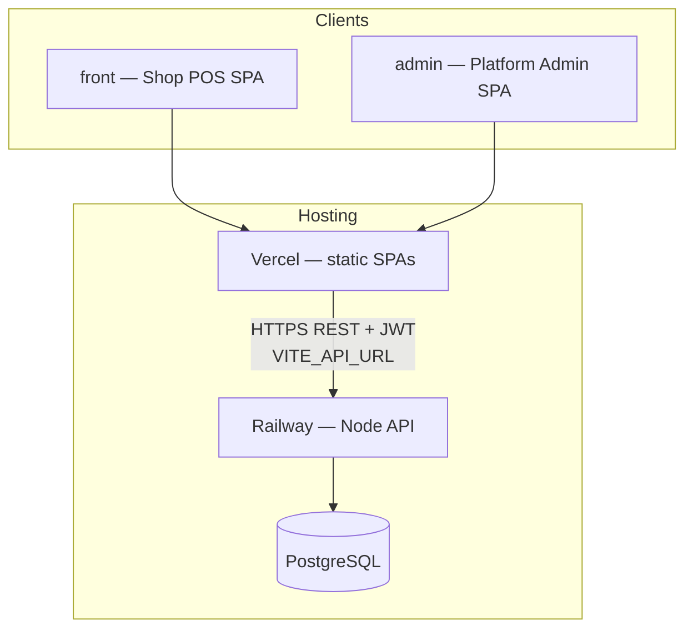
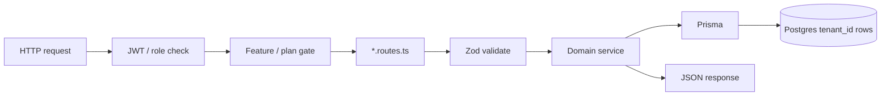
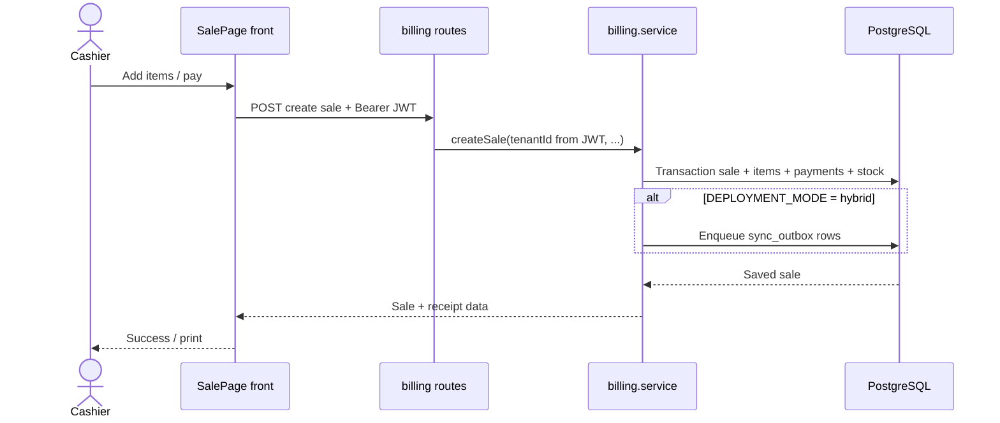

# Raunaq POS — Full Project Context

> **Purpose of this file:** Single source of product/engineering context for humans and AI agents. Prefer this + Prisma schema + `shared/` + `backend/src/modules/` over older “Phase 0” notes in `ARCHITECTURE.md` / BFF §13 when they conflict.

|                     |                                                  |
| ------------------- | ------------------------------------------------ |
| **Product**         | Raunaq POS System                                |
| **Brand**           | Raunaq (built by NexMindSystems)                 |
| **Root package**    | `pos-system` (`package.json`)                    |
| **Repo goal**       | Offline-first point-of-sale for SMBs in Pakistan |
| **Node**            | `>= 20`                                          |
| **Package manager** | npm workspaces                                   |

---

## 1. What this project does

Raunaq POS is a multi-tenant POS platform for shops (retail / SMB). A shop admin and cashiers use the main web app to:

- Sell products (cash, credit/udhaar, split, discounts, held carts, returns/exchanges, receipts)
- Manage inventory (products, categories, brands, suppliers, stock movements)
- Manage customers and customer ledgers (udhaar / credit aging)
- View reports (sales, inventory, staff, aging)
- Manage staff permissions and business settings
- Contact support (“Get Help”) — stores a query and emails the support inbox via SMTP
- Optionally sync local changes to a cloud instance (hybrid mode)

A **Super Admin / platform** side manages tenants (shops), plan features, sales reps, and access revoke/restore.

**Not the same as:** a finished desktop installer or mobile app. Electron and mobile are scaffolds/placeholders.

---

## 2. How it is built (monorepo)

```text
Raunaq POS/                          npm workspaces monorepo
├── shared/       @pos/shared        Feature keys, plans, API types, brand — no React/Prisma
├── front/        @pos/front         Main POS SPA (shop UI + embedded /admin routes)
├── admin/        @pos/admin         Standalone platform-admin SPA (port 5174)
├── backend/      @pos/backend       Fastify REST API + Prisma + PostgreSQL + Vitest
├── electron/     @pos/electron      Desktop wrapper — scaffold only
├── mobile/                          Placeholder (future React Native / Expo)
├── docs/                            Schema, BFF, getting-started
├── .cursor/rules/                   Always-on agent rules (points here)
├── .github/workflows/ci.yml         CI: format, lint, typecheck, build, backend tests
├── ARCHITECTURE.md                  Design notes (some sections stale)
├── README.md                        Setup + structure map
└── PROJECT-CONTEXT.md               This file
```

### System flow (cloud web)



### Request path inside the API



### Sale checkout flow (happy path)



### Data / request flow (text)

```text
Browser (front or admin)
    │  REST JSON + Bearer JWT
    │  Dev: Vite proxies /api → localhost:3001
    │  Prod: VITE_API_URL → Railway (or similar) backend
    ▼
Fastify API (backend)
    │  Zod validate → services → Prisma
    ▼
PostgreSQL (shared DB, tenant_id isolation)
```

### Roles

| Role           | Who                | Scope                                 |
| -------------- | ------------------ | ------------------------------------- |
| `SUPER_ADMIN`  | Platform operator  | All tenants; admin UIs                |
| `CLIENT_ADMIN` | Shop owner/manager | Own tenant; staff + settings          |
| `STAFF`        | Cashier / employee | Own tenant; features granted per user |

Tenant for Client Admin / Staff is **always taken from the JWT** (not from the client body). Super Admin picks tenant via route params.

---

## 3. Tech stack

### Frontend (`front`, `admin`)

| Layer                 | Tech                                 |
| --------------------- | ------------------------------------ |
| UI                    | React 19                             |
| Bundler               | Vite 6                               |
| Language              | TypeScript 5.8                       |
| Routing               | React Router DOM 7                   |
| Server state          | TanStack Query 5                     |
| Styling               | Tailwind CSS 4 (`@tailwindcss/vite`) |
| Shared types/features | `@pos/shared`                        |

### Backend (`backend`)

| Layer            | Tech                                                      |
| ---------------- | --------------------------------------------------------- |
| HTTP             | Fastify 5                                                 |
| Logging          | Pino                                                      |
| ORM / DB         | Prisma 6 + PostgreSQL 16                                  |
| Validation       | Zod                                                       |
| Auth             | JWT access + opaque refresh tokens; argon2 passwords      |
| Security plugins | `@fastify/cors`, `@fastify/helmet`, `@fastify/rate-limit` |
| Email            | nodemailer (support queries via SMTP)                     |
| Tests            | Vitest 3 (backend only)                                   |
| Dev runner       | `tsx`                                                     |

### Shared (`shared`)

- Pure TypeScript library compiled to `dist/`
- Feature registry, plan/tier access helpers, brand constants, shared API shapes
- **No** React, Prisma, or Node server code

### Electron (`electron`)

- Electron 35 + TypeScript
- Intended to host local API + local Postgres for offline shops
- **Status:** stubs only (`main.ts`, `backend-host.ts`, postgres manager)

### Planned in architecture docs but **not wired in code**

- BullMQ + Redis job queues
- Sentry error tracking
- node-cron scheduled jobs
- React Native / Expo mobile (Phase 7)

Sync today uses an **in-process interval worker**, not Redis/BullMQ.

---

## 4. Product features (what ships)

Feature keys live in `shared/src/features.ts` — **only implemented features** are listed.

### Billing / POS

- Create sale, void, returns, exchange handoff to new sale
- Payment methods: cash, credit, split, etc.
- Discounts (incl. unlimited gate), held carts, gift cards
- Receipt print: browser + ESC/POS network printer helpers
- UI: `front/src/features/billing/` (`SalePage`, `SalesHistoryPage`, …)

### Inventory & catalog

- Products, categories, brands, suppliers
- Stock adjust + stock movements
- Supplier ledger (purchase / payment)
- UI: `inventory/`, `catalog/`

### Customers & udhaar

- Customer CRUD
- Credit ledger, FIFO payment allocation, obligations, aging
- UI: `customers/`

### Reports

- Daily / summary sales, inventory, staff performance, udhaar aging
- Advanced reports feature-gated (`reports.advanced`)
- UI: `reports/`

### Staff & settings

- Staff users + per-user feature grants
- Business settings: tax, printer, receipt branding, FBR **fields** (not live FBR API)
- Multi-branch via `X-Branch-Id` when `multi_branch.access` is on

### Support

- Shop submits “Get Help” query with contact email
- Backend saves `SupportQuery` and emails inbox (default `info@nexmindsystems.com`) via SMTP env vars
- Without Railway/SMTP config, email delivery fails (API may return 502/503 after persisting the row)

### Plans / entitlements

| Tier                     | Keys                                 |
| ------------------------ | ------------------------------------ |
| STARTER / STANDARD / PRO | `shared` + `subscription.service.ts` |

- Trial / paid windows; ended period hard-blocks login (pay / convert); manual revoke
- Upgrade CTA often WhatsApp (`UPGRADE_WHATSAPP_URL`)
- Front gates routes/UI with feature helpers + `FeatureGate`

### Platform admin

- Tenants CRUD, feature assignment, revoke/restore
- Sales reps, dashboard
- Surfaces: `front` routes under `/admin/*` **and** standalone `admin/` app

### Sync (hybrid / cloud)

| Mode (`DEPLOYMENT_MODE`) | Behavior                                                          |
| ------------------------ | ----------------------------------------------------------------- |
| `offline` (default)      | No sync worker / outbox push                                      |
| `hybrid`                 | Local writes enqueue `sync_outbox`; worker pushes to cloud        |
| `cloud`                  | Exposes ingest/pull for devices (`/sync/ingest`, `/sync/changes`) |

Important: outbox enablement must follow **live** `process.env.DEPLOYMENT_MODE` (see `isSyncOutboxActive` / `syncOutboxEnabled`) — not a frozen `appConfig` snapshot — so tests and runtime flips stay consistent.

**Known sync limit:** DELETE apply is not implemented in Phase 1 (`apply-change.ts`).

---

## 5. Backend module map

Path: `backend/src/modules/`

| Module        | Responsibility                                   |
| ------------- | ------------------------------------------------ |
| `auth`        | Login, refresh, logout, change password, `/me`   |
| `users`       | Staff CRUD / features                            |
| `tenants`     | Tenant lifecycle (admin)                         |
| `admin`       | Platform dashboard / sales reps / tenant ops     |
| `billing`     | Sales, returns, payments, held carts, gift cards |
| `inventory`   | Products, stock                                  |
| `catalog`     | Brands, suppliers, supplier ledger               |
| `customers`   | Customers + udhaar ledger                        |
| `reports`     | Aggregations / summaries                         |
| `settings`    | Business settings                                |
| `branches`    | Multi-branch                                     |
| `permissions` | Feature middleware / hard-expiry block           |
| `support`     | Support queries + mail                           |
| `sync`        | Outbox, push/pull, ingest, devices, conflicts    |
| `printer`     | Receipt / ESC-POS helpers                        |
| `audit`       | Audit log                                        |
| `core`        | Prisma client, mail, tenant helpers, RLS helpers |

Entry: `backend/src/index.ts` registers routes and (in hybrid) starts the sync worker.

Prisma schema: `backend/prisma/schema.prisma`  
Migrations: `backend/prisma/migrations/`  
Seed: `backend/prisma/seed.ts` (feature registry, tier presets, super admin)

### Main Prisma model groups

- **Tenancy / auth:** `Tenant`, `User`, `RefreshToken`, `SupportQuery`
- **Permissions:** `FeatureRegistry`, `TenantFeature`, `StaffFeature`, `TierPreset`, `LicenseActivation`
- **Catalog / stock:** `Category`, `Brand`, `Supplier`, `SupplierLedgerEntry`, `Product`, `StockMovement`
- **Customers:** `Customer`, `CustomerLedgerEntry`, `CustomerCreditObligation`, `CustomerPaymentAllocation`
- **Billing:** `Sale`, `SaleItem`, `SalePayment`, `SaleReturn`, `HeldCart`, `GiftCard`, `DiscountRule`, `DiscountUsage`, `SaleSequence`
- **Settings:** `BusinessSettings`, `Branch`
- **Sync:** `SyncOutbox`, `SyncState`, `SyncChangelog`, `SyncDevice`
- **Audit:** `AuditLog`

---

## 6. Frontend structure (`front/src`)

```text
app/           App shell, routes, global styles
components/    auth, billing gates, layout (AppShell), UI primitives
features/      page-level domains (billing, inventory, customers, …)
lib/           api-client, auth, features, device helpers, print/pdf
types/         API TypeScript types
```

- Auth: JWT in client; refresh rotation in `api-client.ts`
- Branch header: `X-Branch-Id` when multi-branch
- Feature gates: shared keys + tenant/staff grants
- Mobile UX: hamburger nav, `safeFocus` to avoid phone keyboard covering UI

Admin app (`admin/src`) is a thinner SPA for platform operators (tenants, reps, dashboard).

---

## 7. Auth model

1. Login → access JWT (default **15m**) + refresh token (**7d**, stored hashed)
2. Access claims: `sub`, `tenantId`, `role`, `features`, `mustChangePassword`
3. Passwords: **argon2**
4. Endpoints: `/auth/login`, `/refresh`, `/logout`, `/change-password`, `/me`
5. Soft-lock (plan expired): many features blocked; upgrade / support paths remain; API may return `UPGRADE_REQUIRED` without logging the user out

**Gaps:** email “forgot password” for shop users is **not** productized (Client Admin can reset staff). SMTP is used for **support mail**, not full auth email flows.

---

## 8. How to run locally (workflow)

### Prerequisites

- Node 20+
- PostgreSQL 16+
- npm 10+

### First-time setup

```bash
npm install
npm run build --workspace=shared

cp backend/.env.example backend/.env
cp front/.env.example front/.env
# Edit DATABASE_URL, JWT_SECRET, JWT_REFRESH_SECRET

npm run db:generate --workspace=backend
npm run db:migrate --workspace=backend
npm run db:seed --workspace=backend
```

Default seed Super Admin (override with `SEED_SUPER_ADMIN_*`):

- Email: `admin@pos.local`
- Password: `ChangeMe123!`

### Day-to-day

```bash
npm run dev:all          # API :3001 + front :5173
# or separately:
npm run dev:api
npm run dev
npm run dev:admin        # admin :5174
```

### Quality scripts

```bash
npm run format / format:check
npm run lint
npm run typecheck
npm run build
npm run test --workspace=backend
```

**Windows note:** If `npm ci` fails with `EPERM` on `lightningcss*.node`, stop Vite/dev Node processes that lock the file, then retry `npm ci` and `npm run db:generate --workspace=backend`.

---

## 9. Deployment & CI

| Piece     | Typical host                       | Notes                                                                               |
| --------- | ---------------------------------- | ----------------------------------------------------------------------------------- |
| POS SPA   | **Vercel** (`front/vercel.json`)   | Set `VITE_API_URL` to backend origin (no `/api` suffix)                             |
| Admin SPA | **Vercel** (`admin/vercel.json`)   | Same API URL pattern                                                                |
| API       | **Railway** (or similar Node host) | `DATABASE_URL`, JWT secrets, CORS, SMTP, optional sync vars                         |
| DB        | Managed Postgres                   | Avoid Supabase transaction pooler `:6543` for Prisma migrate; prefer direct/session |

### CI (`.github/workflows/ci.yml`)

On push/PR to `main` / `develop`:

1. Node 20 + Docker Postgres 16
2. `npm ci`
3. Build `shared`
4. `prisma generate`
5. Prettier check → lint → typecheck
6. Build front + backend
7. `prisma migrate deploy` + Vitest on backend

Prisma client **must** be generated before typecheck (CI and `backend` `postinstall`).

---

## 10. Environment variables (patterns)

Never commit real secrets. Use examples only.

### Backend (required)

- `DATABASE_URL`
- `JWT_SECRET` / `JWT_REFRESH_SECRET` (≥ 32 chars in production)

### Backend (common)

- `DEPLOYMENT_MODE` = `offline` | `hybrid` | `cloud`
- `TENANT_ID` (offline/hybrid single-tenant installs)
- `PORT`, `HOST`, `NODE_ENV`, `CORS_ORIGINS` (prod), `TRUST_PROXY`
- `UPGRADE_WHATSAPP_URL`
- SMTP for support: `SMTP_HOST`, `SMTP_PORT`, `SMTP_USER`, `SMTP_PASS`, `SMTP_FROM`, optional support inbox override
- Sync (hybrid/cloud): `SYNC_CLOUD_URL`, `SYNC_API_KEY`, `SYNC_DEVICE_ID`, interval/batch/retry knobs
- Placeholders in docs: `REDIS_URL`, `SENTRY_DSN` (not fully integrated)

### Front / admin

- `VITE_API_URL` — production API base URL
- `VITE_ADMIN_URL` / `VITE_POS_URL` — cross-links between apps

---

## 11. Testing

| Area                     | Coverage                                                                      |
| ------------------------ | ----------------------------------------------------------------------------- |
| Backend unit/integration | Vitest — billing totals, permissions, ledger FIFO, sync outbox/ingest/devices |
| Front / admin            | **No** automated tests                                                        |
| E2E                      | **None**                                                                      |

Integration tests need `DATABASE_URL` (CI provides Postgres). Some suites skip if DB unavailable (`hasTestDatabase()`).

---

## 12. Drawbacks, gaps, and risks

### Product / packaging

1. **Electron incomplete** — offline desktop packaging not shippable yet.
2. **Mobile not started** — `mobile/README.md` only.
3. **No Redis/BullMQ/Sentry** despite architecture mentions — ops/observability thinner than designed.
4. **FBR** — settings/receipt fields only; no live FBR tax authority integration.
5. **Logo upload** — URL string only; no file upload pipeline.
6. **Forgot-password email** for shop users still an open product gap.

### Engineering

7. **Docs drift** — `ARCHITECTURE.md` / parts of `docs/BACKEND-FOR-FRONTEND.md` still read like early scaffold; trust schema + modules + this file.
8. **Sync DELETE** not implemented; conflict UX exists but hybrid installs need careful ops.
9. **Frontend test gap** — regressions in Sale/Inventory/Udhaar rely on manual QA / CI typecheck.
10. **Admin lint** — standalone admin app may lack the same lint script coverage as front.
11. **RLS session** optional and can add latency on remote DBs; tenant isolation primarily app-layer `tenant_id`.
12. **Support email** depends on correct Railway SMTP; misconfig looks like “form broken” when DB write succeeded.

### Ops

13. Split hosting (Vercel + Railway) needs correct `VITE_API_URL` and CORS.
14. Local Windows file locks (`EPERM` on native modules) when Vite stays running during `npm ci`.

---

## 13. AI agent working rules (for this repo)

When changing this codebase:

1. **Respect monorepo boundaries** — shared types/features in `shared/`; UI in `front`/`admin`; business rules + Prisma in `backend`.
2. **Feature keys** — add only implemented features to `shared/src/features.ts`; wire backend middleware + front gates together.
3. **Tenant safety** — never trust client-supplied `tenantId` for Client Admin/Staff; use JWT helpers.
4. **Prisma** — after schema change: migrate + generate; CI runs generate before typecheck.
5. **Formatting** — Prettier is enforced in CI (`format:check`).
6. **Sync flags** — use live `DEPLOYMENT_MODE` checks (`isSyncOutboxActive` / `syncOutboxEnabled`), not frozen config alone.
7. **Secrets** — SMTP/JWT/DB only in host env; never commit `.env`.
8. **Scope** — don’t expand Electron/mobile unless asked; don’t invent Redis/Sentry wiring without an explicit task.
9. **Docs** — prefer updating this file + README when architecture/status changes; treat stale “not built” lists carefully.
10. **Commits** — only when the user asks; don’t force-push `main`.

### Useful entry files for agents

| Intent             | Start here                                            |
| ------------------ | ----------------------------------------------------- |
| Feature permission | `shared/src/features.ts`, `shared/src/plan-access.ts` |
| Sale logic         | `backend/src/modules/billing/billing.service.ts`      |
| API client         | `front/src/lib/api-client.ts`                         |
| Routes (POS)       | `front/src/app/routes.tsx`                            |
| Schema             | `backend/prisma/schema.prisma`                        |
| Sync               | `backend/src/modules/sync/`                           |
| Support email      | `backend/src/modules/core/mail.ts`, `support/`        |
| CI                 | `.github/workflows/ci.yml`                            |
| Brand / footer     | `shared/src/brand.ts`                                 |

---

## 14. Related docs

| Doc                                                            | Use for                                     |
| -------------------------------------------------------------- | ------------------------------------------- |
| [README.md](README.md)                                         | Quick start + folder tree                   |
| [ARCHITECTURE.md](ARCHITECTURE.md)                             | Design intent (verify against code)         |
| [docs/SCHEMA.md](docs/SCHEMA.md)                               | Table/relationship design                   |
| [docs/BACKEND-FOR-FRONTEND.md](docs/BACKEND-FOR-FRONTEND.md)   | API ↔ screen mapping (spot-check freshness) |
| [docs/setup/getting-started.md](docs/setup/getting-started.md) | Local setup detail                          |
| [mobile/README.md](mobile/README.md)                           | Future mobile phase                         |

---

## 15. One-paragraph summary

**Raunaq POS** is a TypeScript npm-workspaces monorepo: React/Vite/Tailwind shop and admin SPAs talk to a Fastify/Prisma/PostgreSQL API with JWT auth, multi-tenant row isolation, plan-based feature gates, full POS domains (sales, inventory, udhaar, reports, staff, support email), and optional hybrid sync. Web deploy is typically Vercel + Railway + Postgres; Electron offline packaging and mobile are not done yet; CI enforces format, types, builds, and backend Vitest. Use this file as the living project brief for people and AI.
